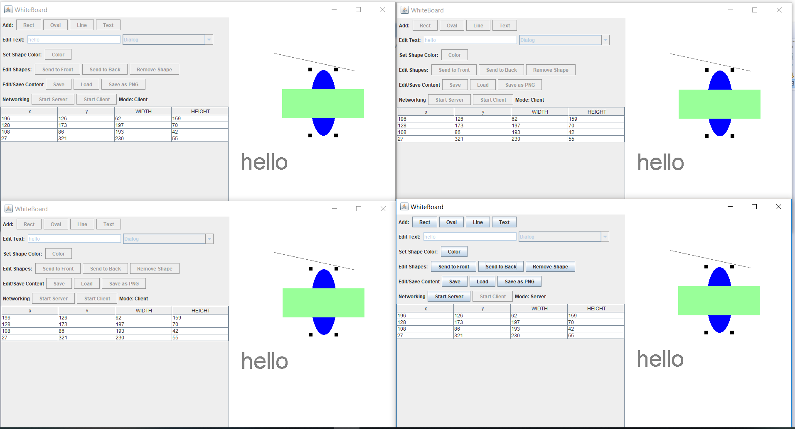

# WhiteBoard
CS151 WhiteBoard Project

There are three parts to this application:

1) Graphical User Interface (The digital whiteboard): 

* Creating and deleting shapes and text. 
* Changing objects color.
* Implemented a form of the model-view-controller design pattern.

2) File IO: 

* Saving and loading XML files 
* Saving as a PNG image

3) Basic Networking: Client-Server Architecture 

* The server is capable of changing all the whiteboards (clients) connected to it.

Example Picture:

Project completed on 12/19/2017  
Some bug fixed on 12/25/2018

